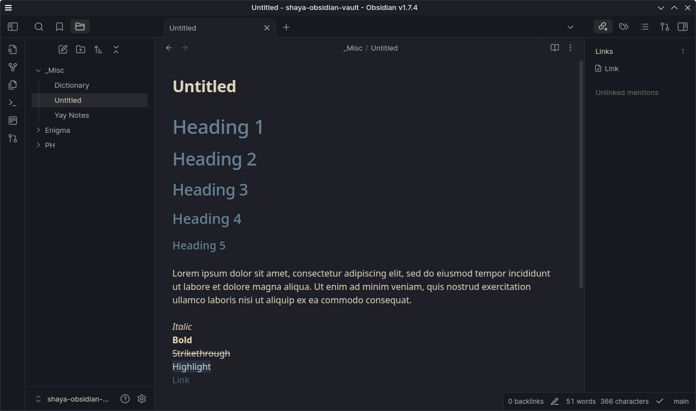

  <h2 align="center">🌊 KANAGAWA.obsidian 🌊</h2>

  

Obsidian dark colorscheme inspired by the colors of the famous painting by Katsushika Hokusai.

  

### Key changes of this fork
- Less distracting panels separation
- Single color heading palette
- Other minor fixes and tweaks

## Installation
- Copy the `obsidian.css` file to your vault directory and reload Obsidian for it to take effect.
